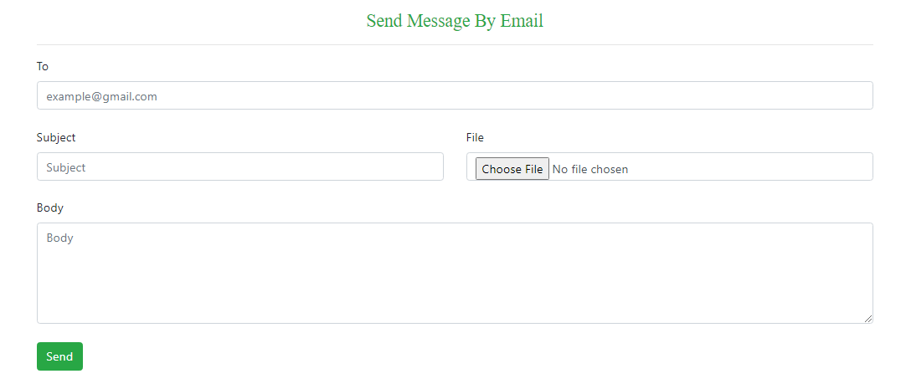

# SMTP-Server


# Introduction

> In this article, we will learn how to send an email in ASP.Net Core Web Application

# Create the ASP.Net Core Web API Project

> First, you need to create the ASP.Net core web project using the ASP.Net core 5 web Application.

# Install the MailKit Nuget Package

```
Install-Package NETCore.MailKit
```
You need to include the following namespaces in your code for the correct configuration.
```
using MailKit.Net.Smtp;

using MailKit.Security;
```
# Add the Folder Model
```
using Microsoft.AspNetCore.Http;
using System;
using System.Collections.Generic;
using System.Linq;
using System.Threading.Tasks;

namespace _101SendEmailNotificationDoNetCoreWebAPI.Model
{
    public class MailRequest
    {
        public string ToEmail { get; set; }
        public string Subject { get; set; }
        public string Body { get; set; }
        public List<IFormFile> Attachments { get; set; }
    }
}
```
# Not Add the Folder Services
 After the creation of the folder now add the following classes.
 ## IMailService
 ```
 using _101SendEmailNotificationDoNetCoreWeb.Model;
using System.Threading.Tasks;
namespace _101SendEmailNotificationDoNetCoreWeb.Services
{
    public interface IMailService
    {
        Task SendEmailAsync(MailRequest mailRequest);

    }
}
 ```
 ## MailService
 ```
 using MimeKit;
using System.IO;
using System.Threading.Tasks;
using MailKit.Net.Smtp;
using MailKit.Security;
using Microsoft.Extensions.Options;
using _101SendEmailNotificationDoNetCoreWeb.Settings;
using _101SendEmailNotificationDoNetCoreWeb.Model;
namespace _101SendEmailNotificationDoNetCoreWeb.Services
{
    public class MailService : IMailService
    {
        private readonly MailSettings _mailSettings;
        public MailService(IOptions<MailSettings> mailSettings)
        {
            _mailSettings = mailSettings.Value;
        }
        public async Task SendEmailAsync(MailRequest mailRequest)
        {
            var email = new MimeMessage();
            email.Sender = MailboxAddress.Parse(_mailSettings.Mail);
            email.To.Add(MailboxAddress.Parse(mailRequest.ToEmail));
            email.Subject = mailRequest.Subject;
            var builder = new BodyBuilder();
            if (mailRequest.Attachments != null)
            {
                byte[] fileBytes;
                foreach (var file in mailRequest.Attachments)
                {
                    if (file.Length > 0)
                    {
                        using (var ms = new MemoryStream())
                        {
                            file.CopyTo(ms);
                            fileBytes = ms.ToArray();
                        }
                        builder.Attachments.Add(file.FileName, fileBytes, ContentType.Parse(file.ContentType));
                    }
                }
            }
            builder.HtmlBody = mailRequest.Body;
            email.Body = builder.ToMessageBody();
            using var smtp = new SmtpClient();
            smtp.Connect(_mailSettings.Host, _mailSettings.Port, SecureSocketOptions.StartTls);
            smtp.Authenticate(_mailSettings.Mail, _mailSettings.Password);
            await smtp.SendAsync(email);
            smtp.Disconnect(true);
        }
    }
}
 ```
 
 # Add the Folder Settings
 ```
 namespace _101SendEmailNotificationDoNetCoreWeb.Settings
{
    public class MailSettings
    {
        public string Mail { get; set; }
        public string DisplayName { get; set; }
        public string Password { get; set; }
        public string Host { get; set; }
        public int Port { get; set; }
    }
}
 ```
 
 # Add the Controller in the project
 ```
 using _101SendEmailNotificationDoNetCoreWeb.Model;
using _101SendEmailNotificationDoNetCoreWeb.Services;
using Microsoft.AspNetCore.Mvc;
using System;
using System.Threading.Tasks;

namespace _101SendEmailNotificationDoNetCoreWeb.Controllers
{
   
    public class EmailController : Controller
    {

        private readonly IMailService mailService;
        public EmailController(IMailService mailService)
        {
            this.mailService = mailService;
        }
        [HttpGet]
        public IActionResult Privacy(){
         return view();
         }
        [HttpPost()]
        public async Task<IActionResult> Index(MailRequest request)
        {
           
            try
            {
                await mailService.SendEmailAsync(request);
                return RedirectToAction(nameof(Privacy));
            }
            catch (Exception ex)
            {

               ModelSate.AddModelError(string.Empty,"Try Again");
            }
            return view(request);

        }


    }
}
 ```
<a href="https://code-maze.com/aspnetcore-send-email/">More Details...</a>

